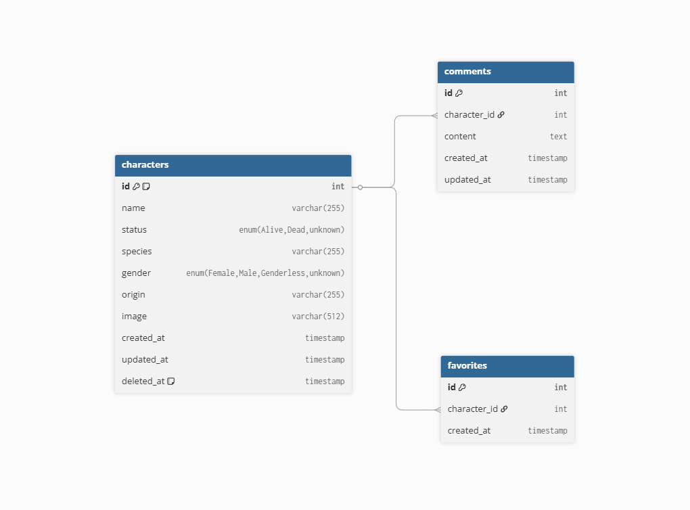

# Rick and Morty Character Manager

Full-stack app for browsing and managing Rick and Morty characters. The backend is a GraphQL API backed by PostgreSQL and Redis. The frontend is a React app with search, filters, favorites, and comments.

## Tech Stack

| Layer    | Technology                                              |
| -------- | ------------------------------------------------------- |
| Frontend | React, TypeScript, Apollo Client, Tailwind CSS, Vite    |
| Backend  | Node.js, Express, Apollo Server Express, GraphQL, Sequelize |
| Database | PostgreSQL (Docker)                                     |
| Cache    | Redis (Docker)                                          |

## Architecture

```
┌────────────┐     GraphQL      ┌────────────┐
│   Client   │ ──────────────▶  │   Server   │
│  (React)   │ ◀──────────────  │ (Express)  │
└────────────┘                  └─────┬──────┘
  port 3000                          │
                               ┌──────┴──────┐
                          ┌────▼────┐   ┌────▼────┐
                          │PostgreSQL│   │  Redis  │
                          │  :5432  │   │  :6379  │
                          └─────────┘   └─────────┘
```

## Project Structure

```
├── client/     # React frontend — see client/README.md
├── server/     # GraphQL backend — see server/README.md
└── docs/
    └── ERD.png # Database entity-relationship diagram
```

## Getting Started

### 1. Clone

```bash
git clone https://github.com/loaiza000/rick-and-morty-assessment.git
cd rick-and-morty-assessment
```

### 2. Backend

```bash
cd server
docker compose up -d
npm install
cp .env.example .env
npm run build
npm run migrate
npm run seed
npm run dev
```

The `.env.example` includes safe defaults that match `docker-compose.yml` — no edits needed for local development. See [server/README.md](./server/README.md) for full details.

### 3. Frontend

In a new terminal:

```bash
cd client
npm install
cp .env.example .env
npm run dev
```

The `.env.example` points to `http://localhost:4001/graphql` by default.

The app will be available at **http://localhost:3000**.

## Database ERD



## Notes

- Both `server/.env` and `client/.env` are required but excluded from version control. Each folder includes a `.env.example` with working defaults.
- Redis is optional — the backend works without it.
- The seeder fetches characters from the external Rick and Morty API. Internet access is required during `npm run seed`.